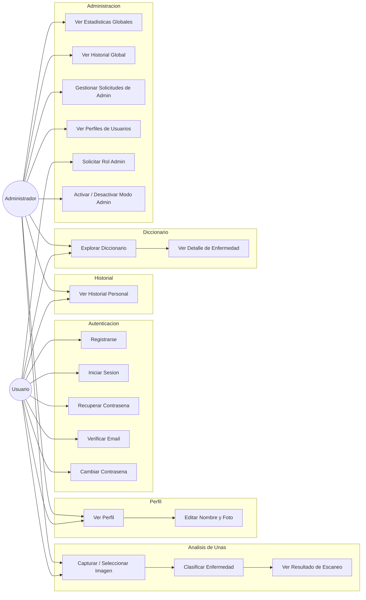
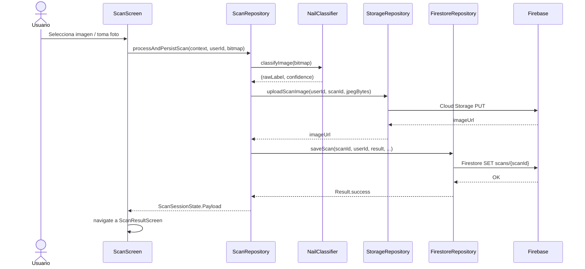
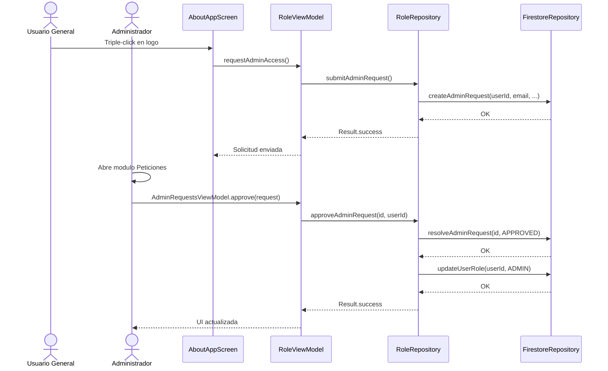
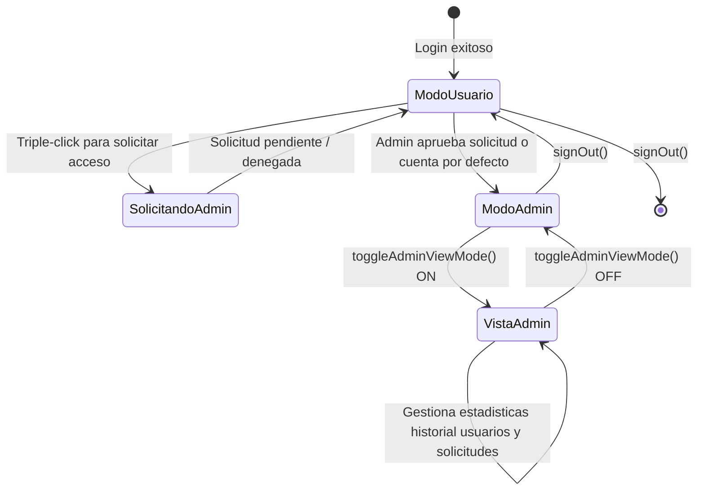
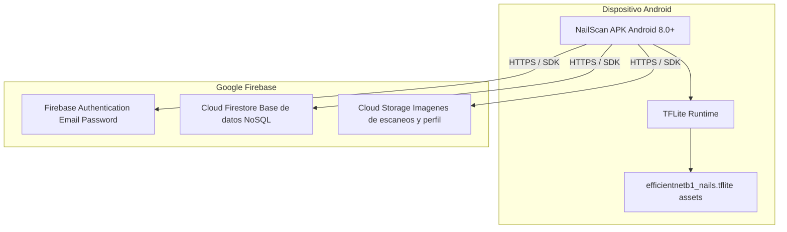

# Diagramas UML - NailScan

> Diagramas elaborados con sintaxis **Mermaid**. Para usarlos en Mermaid Live, copia solamente el contenido que está dentro del bloque, empezando por `graph`, `classDiagram`, `sequenceDiagram` o `stateDiagram-v2`. No copies el título Markdown ni las líneas de apertura/cierre del bloque.

---

## 1. Diagrama de Casos de Uso

---

## 2. Diagrama de Clases

```mermaid
classDiagram
    direction TB

    %% DATA MODELS
    class UserProfile {
        +uid: String
        +fullName: String
        +email: String
        +photoUrl: String
        +role: UserRole
    }

    class UserRole {
        <<enumeration>>
        USER
        ADMIN
    }

    class ScanRecord {
        +id: String
        +userId: String
        +result: String
        +rawLabel: String
        +confidence: Float
        +imageUrl: String
        +dictionaryTermId: String
        +createdAt: FirebaseTimestamp
    }

    class AdminRequest {
        +id: String
        +userId: String
        +email: String
        +fullName: String
        +status: AdminRequestStatus
        +createdAt: FirebaseTimestamp
    }

    class AdminRequestStatus {
        <<enumeration>>
        PENDING
        APPROVED
        DENIED
    }

    class DictionaryTerm {
        +id: String
        +title: String
        +description: String
        +imageUrl: String
    }

    class DictionaryTermDetail {
        +id: String
        +title: String
        +description: String
        +symptoms: String
        +causes: String
        +recommendations: String
        +imageUrl: String
    }

    class ClassificationStat {
        +label: String
        +count: Int
    }

    %% REPOSITORIES
    class AuthRepository {
        +currentUser: FirebaseUser?
        +signIn(email, password): Result
        +signUp(email, password, fullName): Result
        +getUserProfile(): UserProfile?
        +updateUserProfile(fullName): Result
        +updateUserProfilePhoto(jpegBytes): Result
        +sendPasswordResetEmail(email): Result
        +changePassword(current, new): Result
        +signOut()
    }

    class FirestoreRepository {
        +saveUserProfile(profile): Result
        +getUserProfile(uid): UserProfile?
        +updateUserRole(uid, role): Result
        +observeScans(userId): Flow
        +saveScan(): Result
        +observeAllUsers(): Flow
        +observeAllAppScans(): Flow
        +observeAllAppScansForStats(): Flow
        +createAdminRequest(request): Result
        +getPendingAdminRequestForUser(uid): AdminRequest?
        +observePendingAdminRequests(): Flow
        +resolveAdminRequest(id, status): Result
        +ensureDefaultAdmin(): Result
    }

    class StorageRepository {
        +uploadScanImage(userId, scanId, bytes): Result
        +uploadProfilePhoto(userId, bytes): Result
    }

    class ScanRepository {
        +processAndPersistScan(context, userId, bitmap): Result
    }

    class RoleRepository {
        +loadCurrentRole(): UserRole
        +submitAdminRequest(): Result
        +hasPendingAdminRequest(): Boolean
        +observePendingAdminRequests(): Flow
        +observeAllUsers(): Flow
        +approveAdminRequest(id, userId): Result
        +denyAdminRequest(id): Result
        +ensureAdminAccessReady(): Result
    }

    class DictionaryRepository {
        +getTerms(): List
        +getTermDetail(id): DictionaryTermDetail?
    }

    %% VIEW MODELS
    class LoginViewModel {
        +uiState: StateFlow
        +login(email, password)
        +clearError()
    }

    class RegisterViewModel {
        +uiState: StateFlow
        +register(email, password, name)
        +clearError()
    }

    class ProfileViewModel {
        +uiState: StateFlow
        +refresh()
        +updateProfile(fullName)
        +uploadProfilePhoto(bytes)
        +signOut()
    }

    class HomeViewModel {
        +uiState: StateFlow
        +bindAdminViewMode(isAdmin)
        +refresh()
    }

    class HistoryViewModel {
        +uiState: StateFlow
        +bindAdminViewMode(isAdmin)
        +refresh()
    }

    class RoleViewModel {
        +roleState: StateFlow
        +toggleAdminViewMode()
        +requestAdminAccess(onMessage)
        +refresh()
    }

    class AdminRequestsViewModel {
        +uiState: StateFlow
        +bindAdminViewMode(isAdmin)
        +approve(request)
        +deny(request)
    }

    class AdminUsersViewModel {
        +uiState: StateFlow
        +bindAdminViewMode(isAdmin)
        +refresh()
    }

    class DictionaryViewModel {
        +uiState: StateFlow
        +loadTerms()
        +loadDetail(id)
    }

    class ForgotPasswordViewModel {
        +uiState: StateFlow
        +sendResetEmail(email)
    }

    class ChangePasswordViewModel {
        +uiState: StateFlow
        +changePassword(current, new)
    }

    class NailClassifier {
        +classifyImage(bitmap): Pair
        +close()
    }

    %% RELACIONES
    UserProfile "1" --> "1" UserRole
    AdminRequest "1" --> "1" AdminRequestStatus
    ScanRecord --> DictionaryTerm : dictionaryTermId

    AuthRepository --> FirestoreRepository
    AuthRepository --> StorageRepository
    ScanRepository --> FirestoreRepository
    ScanRepository --> StorageRepository
    ScanRepository --> NailClassifier
    RoleRepository --> FirestoreRepository

    LoginViewModel --> AuthRepository
    RegisterViewModel --> AuthRepository
    ProfileViewModel --> AuthRepository
    HomeViewModel --> AuthRepository
    HomeViewModel --> FirestoreRepository
    HomeViewModel --> RoleRepository
    HistoryViewModel --> FirestoreRepository
    HistoryViewModel --> RoleRepository
    RoleViewModel --> RoleRepository
    AdminRequestsViewModel --> RoleRepository
    AdminUsersViewModel --> RoleRepository
    DictionaryViewModel --> DictionaryRepository
    ForgotPasswordViewModel --> AuthRepository
    ChangePasswordViewModel --> AuthRepository
```

---

## 3. Diagrama de Componentes (Arquitectura)

```mermaid
graph TD
    subgraph ANDROID[Android App]
        subgraph UI[UI Layer]
            SCR[Screens Compose]
            COMP[Components BottomBar BrandHeader Chart Badge]
            NAV[Navigation NavHost NavController]
        end

        subgraph VM[ViewModel Layer]
            VM_LOGIN[LoginViewModel]
            VM_REG[RegisterViewModel]
            VM_HOME[HomeViewModel]
            VM_HIST[HistoryViewModel]
            VM_PROF[ProfileViewModel]
            VM_ROLE[RoleViewModel]
            VM_AREQ[AdminRequestsViewModel]
            VM_AUSR[AdminUsersViewModel]
            VM_DICT[DictionaryViewModel]
        end

        subgraph REPOS[Repository Layer]
            REPO_AUTH[AuthRepository]
            REPO_FS[FirestoreRepository]
            REPO_ST[StorageRepository]
            REPO_SCAN[ScanRepository]
            REPO_ROLE[RoleRepository]
            REPO_DICT[DictionaryRepository]
        end

        subgraph ML
            CLF[NailClassifier TFLite EfficientNetB1]
            ASSET[efficientnetb1_nails.tflite]
        end
    end

    subgraph FIREBASE[Firebase Backend]
        FAUTH[Firebase Auth]
        FST[Cloud Firestore users scans admin_requests dictionary_terms]
        FSTOR[Cloud Storage scan_images profile_photos]
    end

    SCR --> NAV
    SCR --> COMP
    SCR --> VM_LOGIN
    SCR --> VM_REG
    SCR --> VM_HOME
    SCR --> VM_HIST
    SCR --> VM_PROF
    SCR --> VM_ROLE
    SCR --> VM_AREQ
    SCR --> VM_AUSR
    SCR --> VM_DICT

    VM_LOGIN --> REPO_AUTH
    VM_REG --> REPO_AUTH
    VM_HOME --> REPO_AUTH
    VM_HOME --> REPO_FS
    VM_HOME --> REPO_ROLE
    VM_HIST --> REPO_FS
    VM_HIST --> REPO_ROLE
    VM_PROF --> REPO_AUTH
    VM_ROLE --> REPO_ROLE
    VM_AREQ --> REPO_ROLE
    VM_AUSR --> REPO_ROLE
    VM_DICT --> REPO_DICT

    REPO_SCAN --> CLF
    CLF --> ASSET

    REPO_AUTH --> FAUTH
    REPO_AUTH --> REPO_FS
    REPO_FS --> FST
    REPO_ST --> FSTOR
    REPO_SCAN --> REPO_FS
    REPO_SCAN --> REPO_ST
    REPO_ROLE --> REPO_FS
```

---

## 4. Diagrama de Secuencia - Escaneo de Una

---

## 5. Diagrama de Secuencia - Solicitud y Aprobacion de Rol Admin

---

## 6. Diagrama de Estado - Modo Admin

---

## 7. Diagrama de Despliegue

---

## Resumen de la Arquitectura

| Capa | Tecnología | Responsabilidad |
|---|---|---|
| **UI** | Jetpack Compose | Pantallas, navegación y componentes visuales |
| **ViewModel** | ViewModel + StateFlow | Estado de UI, lógica de presentación |
| **Repository** | Kotlin Coroutines | Acceso a datos, abstracción de fuentes externas |
| **ML** | TensorFlow Lite | Clasificación de enfermedades en uñas en el dispositivo |
| **Auth** | Firebase Authentication | Registro, login y gestión de sesión |
| **Base de datos** | Cloud Firestore | Perfiles, escaneos, solicitudes admin, diccionario |
| **Almacenamiento** | Cloud Storage | Imágenes de escaneos y fotos de perfil |
