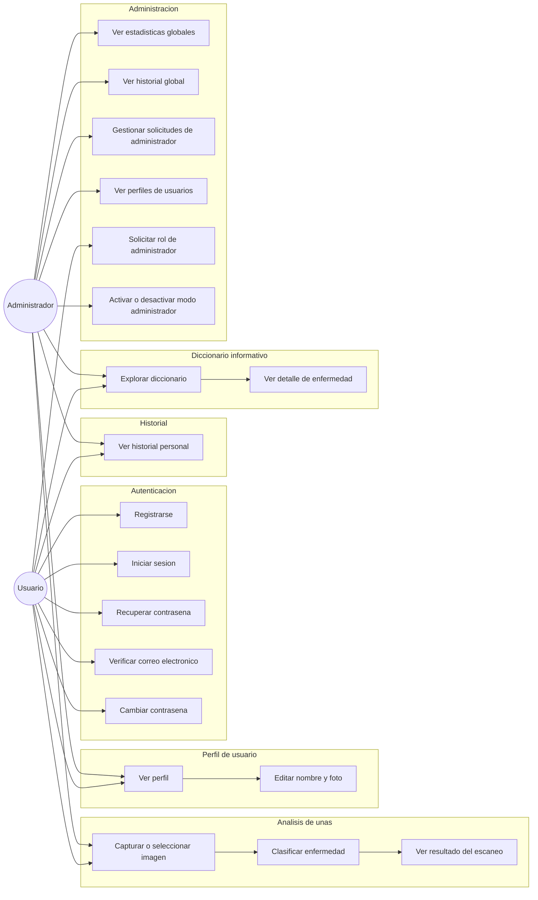
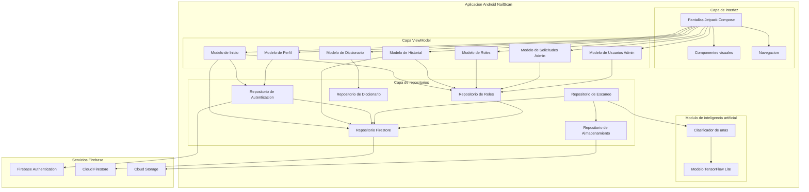
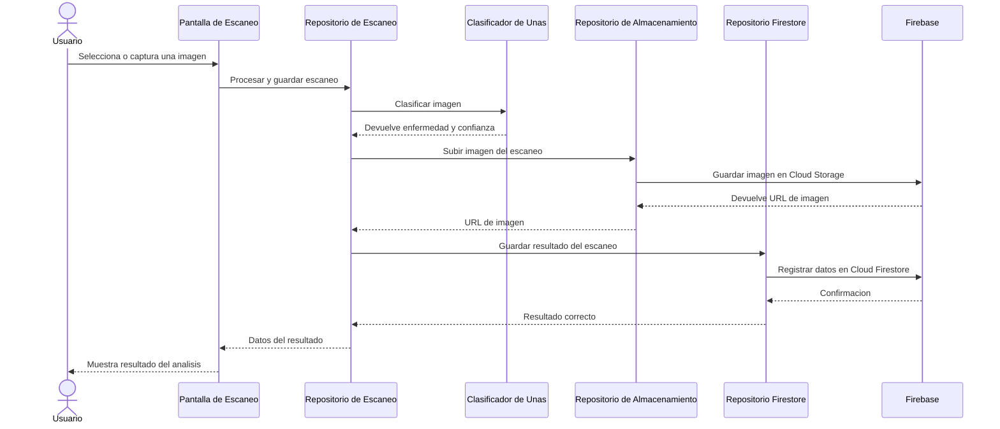
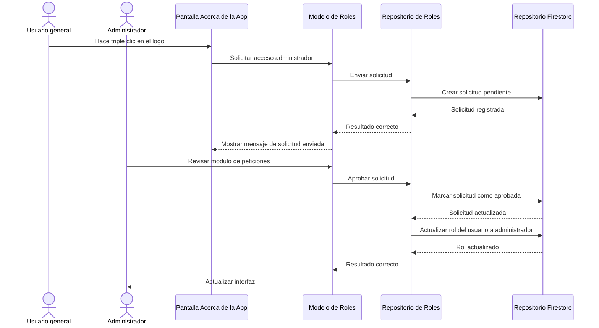
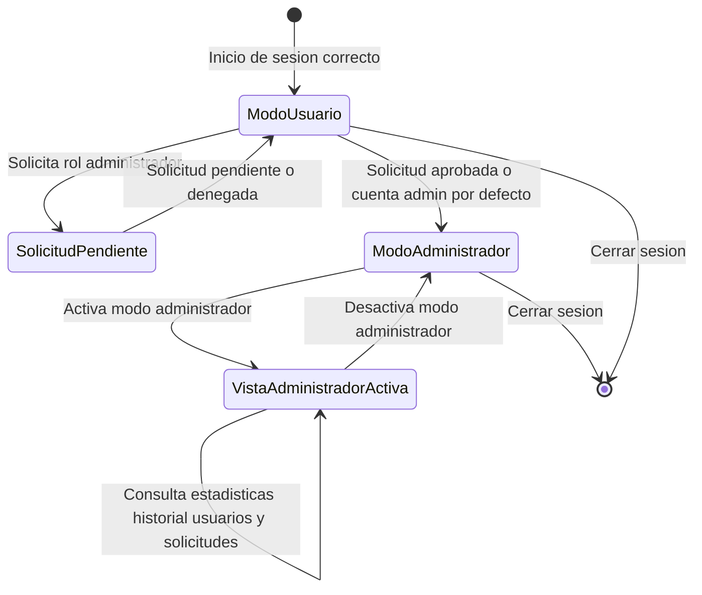
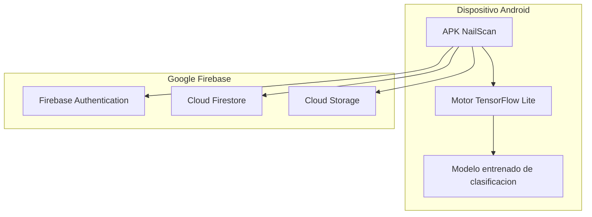

# Diagramas UML en Espanol - NailScan

> Para usar estos diagramas en Mermaid Live, copia solo el contenido interno de cada bloque, empezando por `graph`, `classDiagram`, `sequenceDiagram` o `stateDiagram-v2`.

---

## 1. Diagrama de Casos de Uso

---

## 2. Diagrama de Clases

```mermaid
classDiagram
    direction TB

    class PerfilUsuario {
        +idUsuario: String
        +nombreCompleto: String
        +correo: String
        +urlFoto: String
        +rol: RolUsuario
    }

    class RolUsuario {
        <<enumeracion>>
        USUARIO
        ADMINISTRADOR
    }

    class RegistroEscaneo {
        +id: String
        +idUsuario: String
        +resultado: String
        +etiquetaOriginal: String
        +confianza: Float
        +urlImagen: String
        +idTerminoDiccionario: String
        +fechaCreacion: Fecha
    }

    class SolicitudAdministrador {
        +id: String
        +idUsuario: String
        +correo: String
        +nombreCompleto: String
        +estado: EstadoSolicitud
        +fechaCreacion: Fecha
    }

    class EstadoSolicitud {
        <<enumeracion>>
        PENDIENTE
        APROBADA
        DENEGADA
    }

    class TerminoDiccionario {
        +id: String
        +titulo: String
        +descripcion: String
        +urlImagen: String
    }

    class DetalleTerminoDiccionario {
        +id: String
        +titulo: String
        +descripcion: String
        +sintomas: String
        +causas: String
        +recomendaciones: String
        +urlImagen: String
    }

    class EstadisticaClasificacion {
        +etiqueta: String
        +cantidad: Int
    }

    class RepositorioAutenticacion {
        +usuarioActual: UsuarioFirebase
        +iniciarSesion(correo, contrasena): Resultado
        +registrar(correo, contrasena, nombre): Resultado
        +obtenerPerfilUsuario(): PerfilUsuario
        +actualizarPerfil(nombre): Resultado
        +actualizarFotoPerfil(bytes): Resultado
        +enviarRecuperacionContrasena(correo): Resultado
        +cerrarSesion()
    }

    class RepositorioFirestore {
        +guardarPerfilUsuario(perfil): Resultado
        +obtenerPerfilUsuario(idUsuario): PerfilUsuario
        +actualizarRolUsuario(idUsuario, rol): Resultado
        +observarEscaneos(idUsuario): Flujo
        +guardarEscaneo(): Resultado
        +observarTodosLosUsuarios(): Flujo
        +observarEscaneosGlobales(): Flujo
        +observarEstadisticasGlobales(): Flujo
        +crearSolicitudAdministrador(solicitud): Resultado
        +observarSolicitudesPendientes(): Flujo
        +resolverSolicitud(id, estado): Resultado
    }

    class RepositorioAlmacenamiento {
        +subirImagenEscaneo(idUsuario, idEscaneo, bytes): Resultado
        +subirFotoPerfil(idUsuario, bytes): Resultado
    }

    class RepositorioEscaneo {
        +procesarYGuardarEscaneo(contexto, idUsuario, imagen): Resultado
    }

    class RepositorioRoles {
        +cargarRolActual(): RolUsuario
        +enviarSolicitudAdministrador(): Resultado
        +tieneSolicitudPendiente(): Boolean
        +aprobarSolicitud(id, idUsuario): Resultado
        +denegarSolicitud(id): Resultado
        +prepararAccesoAdministrador(): Resultado
    }

    class RepositorioDiccionario {
        +obtenerTerminos(): Lista
        +obtenerDetalle(id): DetalleTerminoDiccionario
    }

    class ModeloInicio {
        +estadoUi: FlujoEstado
        +vincularModoAdministrador(esAdmin)
        +actualizar()
    }

    class ModeloHistorial {
        +estadoUi: FlujoEstado
        +vincularModoAdministrador(esAdmin)
        +actualizar()
    }

    class ModeloPerfil {
        +estadoUi: FlujoEstado
        +actualizar()
        +actualizarPerfil(nombre)
        +subirFotoPerfil(bytes)
        +cerrarSesion()
    }

    class ModeloRoles {
        +estadoRol: FlujoEstado
        +alternarModoAdministrador()
        +solicitarAccesoAdministrador()
        +actualizar()
    }

    class ModeloSolicitudesAdmin {
        +estadoUi: FlujoEstado
        +vincularModoAdministrador(esAdmin)
        +aprobar(solicitud)
        +denegar(solicitud)
    }

    class ModeloUsuariosAdmin {
        +estadoUi: FlujoEstado
        +vincularModoAdministrador(esAdmin)
        +actualizar()
    }

    class ClasificadorUnas {
        +clasificarImagen(imagen): Par
        +cerrar()
    }

    PerfilUsuario --> RolUsuario
    SolicitudAdministrador --> EstadoSolicitud
    RegistroEscaneo --> TerminoDiccionario

    RepositorioAutenticacion --> RepositorioFirestore
    RepositorioAutenticacion --> RepositorioAlmacenamiento
    RepositorioEscaneo --> RepositorioFirestore
    RepositorioEscaneo --> RepositorioAlmacenamiento
    RepositorioEscaneo --> ClasificadorUnas
    RepositorioRoles --> RepositorioFirestore

    ModeloInicio --> RepositorioAutenticacion
    ModeloInicio --> RepositorioFirestore
    ModeloInicio --> RepositorioRoles
    ModeloHistorial --> RepositorioFirestore
    ModeloHistorial --> RepositorioRoles
    ModeloPerfil --> RepositorioAutenticacion
    ModeloRoles --> RepositorioRoles
    ModeloSolicitudesAdmin --> RepositorioRoles
    ModeloUsuariosAdmin --> RepositorioRoles
```

---

## 3. Diagrama de Componentes

---

## 4. Diagrama de Secuencia - Escaneo de Una

---

## 5. Diagrama de Secuencia - Solicitud de Rol Administrador

---

## 6. Diagrama de Estado - Modo Administrador

---

## 7. Diagrama de Despliegue

